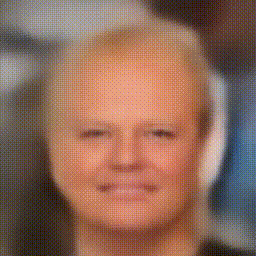
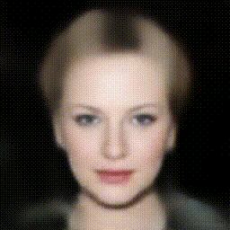

# FaceMorph-VAE
Using a ResNet-based Unet with Variational Autoencoder (VAE) to perform morphs between faces.

## Example 0

  

## Example 1

  

## Example 2

  

## Example 3

  

## Example 4

  

